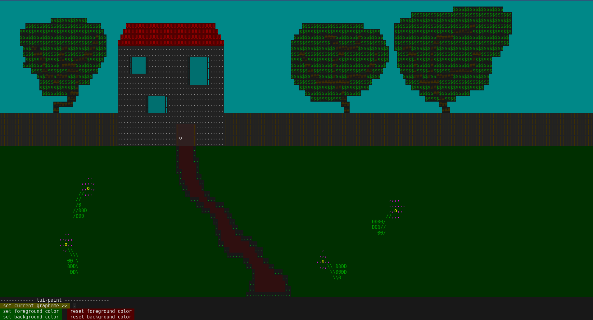

# tui-paint  

tui-paint is a simple drawing app in the terminal, made as an excuse to learn Zig.
It contains no dependencies, including any kind of TUI library, except Zig. 
There is not some big reason to not have dependencies, aside from it being a learning opportunity. This means that
terminal interaction nitty-gritty is out in the open, so it should be relatively easy to check it out.

## Supported terminals
There is no feature checking on what which terminal supports, and most development has been done with Alacritty in mind.
So, Alacritty is what I have faith in most, but it could be that it also works for some other terminals, in which case
cool, but no guarantees.

## Installation

Made with zig 0.13.0.
Clone the repo and run

```
zig build

```
and copy the resulting binary wherever you want. Or just try it out with

```
zig build run

```

## What it looks like



## Usage

There are two parts, the canvas and a toolbar, so mouse interaction changes a bit depending on what you click on.

### Canvas
- left-click, left-drag => freehand drawing
- CTRL + left-click, left-drag => draw straight line
- right-click => set current cell to the clicked cell
- CTRL + right-click => set current cell foreground color to the clicked cell foreground color
- ALT + right-click => set current cell background color to the clicked cell background color
- CTRL + ALT right-click => set the current cell grapheme to the clicked cell grapheme
- middle-click => 4way flood fill - change all neighbouring cells of the same type as the clicked cell to the current cell

### Toolbar
Just left click on toolbar buttons.

- click on [set {} color] -> type in the hex code of the wanted color. ENTER to confirm or ESC to cancel.
- click on [set current grapheme] -> type in the wanted grapheme. Only supports single codepoint graphemes
(watch out for emojis - sometime they are not of the same dimensions as the other letters, whichs screws up the terminal)
- click on [reset {} color] -> reset the current color to the terminal defaults.reset the current color to the terminal defaults.

### Misc keys
- 'q' to exit
- 'u' to undo
- 'r' to redo
- 'f' to "freeze" the terminal - disables mouse support, so you can copy any text you find
- 't' to "thaw" the terminal - enables mouse support
- 'c' to clear the canvas

## Contributing

If you find something that bugs you, open an issue and we'll check it out. Note that, since I find this pretty finished
as it's served its purpose, major changes probably won't happen.

## License

[Unlicense](https://choosealicense.com/licenses/unlicense/)
